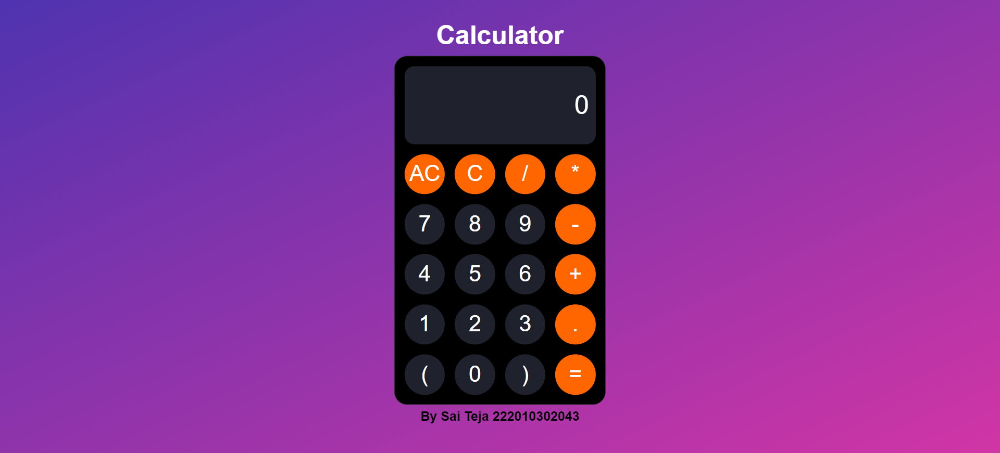

# Calculator 🧮

A sleek and stylish calculator web application built with HTML, CSS, and JavaScript. 💻✨

## Overview 🌟

Welcome to the Calculator! This web application provides a modern and intuitive way to perform basic arithmetic calculations. It features a clean user interface, responsive design, and smooth interactions, making it a convenient tool for your daily calculations. 🚀💯

## Features 🎉

- 💡 **User-Friendly Interface**: The calculator has a minimalist design with a soothing color scheme that is easy on the eyes. The large display screen ensures clear visibility of the input and output.
- 📱 **Responsive Design**: The calculator is designed to work flawlessly across different devices, including desktops, tablets, and mobile phones. It adapts to various screen sizes, providing a consistent user experience.
- ➕ **Basic Arithmetic Operations**: Perform addition, ➖ subtraction, ✖️ multiplication, and ➗ division with ease. The calculator supports both positive and negative numbers.
- 🔢 **Decimal Numbers**: Include decimal points in your calculations to handle fractions and precise values.
- ⚖️ **Parentheses**: Group and prioritize your calculations using parentheses. The calculator respects the order of operations and evaluates expressions accordingly.
- 🔄 **Clear and Backspace**: Use the clear button (AC) to wipe the input screen and start fresh. The backspace button (C) allows you to delete the last entered character.
- ⚡️ **Real-Time Calculation**: The calculator instantly updates the result as you enter or modify your expression, providing a smooth and responsive user experience.

## Screenshot 📷

## Usage 🚀

1. Open the [Calculator](https://your-calculator-url.com) in your web browser.
2. Enter your mathematical expression using the provided buttons and input field.
3. The calculator will automatically display the result in real-time as you type or modify the expression.
4. To perform a new calculation, click the clear button (AC) or use the backspace button (C) to remove specific characters.

## Customization 🎨

The calculator's design and functionality can be easily customized to suit your preferences. Here are a few ways to make it your own:

- 🎨 **Colors**: Adjust the color scheme in the CSS file (`style.css`) to match your personal taste or branding.
- 📐 **Layout**: Modify the grid layout in the HTML file (`index.html`) to change the arrangement of buttons or adjust the size of the display screen.
- 🧰 **Functionality**: Extend the calculator's capabilities by editing the JavaScript file (`script.js`). You can add more operations, implement advanced mathematical functions, or incorporate additional features.

## Contributing 🤝

Contributions are welcome! If you have any suggestions, improvements, or bug fixes, please open an issue or submit a pull request. Let's make the calculator even better together! 🌟✨
